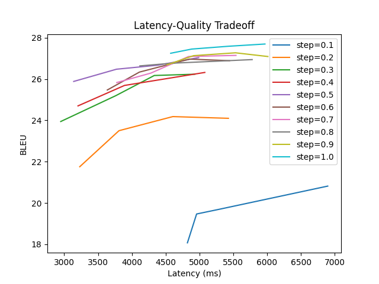

# Cascade with Whisper ASR and M2M100 MT

## Run Experiments

Set environment variables:
```
export REPO_ROOT_PATH=
export PYTHON_ENV_DIR=
```

First, we tune the segment length for Whisper ASR (with ASR step_length=0.5s and translation_la_policy=2 fixed):

| Segment Length |  BLEU  | StreamLAAL | StreamLAAL_CA |
|:--------------:|:------:|:----------:|:-------------:|
|       8      | 21.45  |   3169   |    4274     |
|      12      | 22.96  |   3642   |    5549     |
|      16      | 24.02  |   3876   |    6176     |
|      20      | 25.44  |   4096   |    6928     |
|      24      | 25.64  |   3464   |    5477     |
|      28      | 25.41  |   3563   |    5882     |
|      30      | 25.00  |   3592   |    5907     |

The best result is when using the context of 24 seconds.

Whisper ASR also supports prompting. Prompting allows us to use previous context to lower the WER. We tune the context length (in words):

| ASR Context |  BLEU  | StreamLAAL | StreamLAAL_CA |
|:-----------:|:------:|:----------:|:-------------:|
|      0      | 20.65  |   10332   |    19975    |
|      5      | 20.41  |   10791   |    20396    |
|     10      | 20.35  |   10696   |    20412    |
|     15      | 20.62  |   10628   |    18572    |
|     20      | 20.67  |   10450   |    21724    |
|     25      | 20.68  |   10425   |    19801    |
|     30      | 20.72  |   10393   |    19808    |

Following the previous tuning, we also sweep the minimum segment length (in number of words) for the MT model:

| Number of words |  BLEU  | StreamLAAL | StreamLAAL_CA |
|:---------------:|:------:|:----------:|:-------------:|
|       0         | 26.35  |    8687    |    17700    |
|       5         | 26.49  |    8705    |    19494    |
|      10         | 26.49  |    9346    |    21278    |
|      15         | 26.26  |   10322    |    24236    |
|      20         | 25.81  |   11223    |    30819    |
|      25         | 25.17  |   11899    |    29978    |
|      30         | 24.25  |   12266    |    30210    |

## Final Results

## Cascade Workflow Diagram



| ASR Step Length (seconds)  | MT LA-2 Step (words)   | BLEU   | StreamLAAL  | StreamLAAL_CA |
|:----------------------------:|:----------------------:|:------:|:-----------:|:-------------:|
|           0.1              |           1            | 18.07  |    4742     |    12579     |
|           0.1              |           2            | 19.47  |    4711     |    16625     |
|           0.1              |           3            | 19.69  |    5043     |    19043     |
|           0.1              |           4            | 20.82  |    6871     |    25404     |
|           0.2              |           1            | 21.75  |    3196     |     7325     |
|           0.2              |           2            | 23.50  |    3779     |    18690     |
|           0.2              |           3            | 24.18  |    4575     |    11134     |
|           0.2              |           4            | 24.10  |    5403     |    14514     |
|           0.3              |           1            | 23.94  |    2942     |     5584     |
|           0.3              |           2            | 25.19  |    3761     |     7647     |
|           0.3              |           3            | 26.17  |    4328     |     8742     |
|           0.3              |           4            | 26.24  |    4927     |     9975     |
|           0.4              |           1            | 24.70  |    3197     |     4898     |
|           0.4              |           2            | 25.69  |    3888     |     6103     |
|           0.4              |           4            | 26.32  |    5074     |     9770     |
|           0.5              |           1            | 25.88  |    3136     |     5723     |
|           0.5              |           2            | 26.48  |    3771     |     6164     |
|           0.5              |           3            | 26.67  |    4390     |     7759     |
|           0.5              |           4            | 27.04  |    4987     |     8988     |
|           0.6              |           1            | 25.47  |    3636     |     5109     |
|           0.6              |           2            | 26.34  |    4110     |     5921     |
|           0.6              |           3            | 26.97  |    4850     |     7667     |
|           0.6              |           4            | 26.89  |    5443     |     8778     |
|           0.7              |           1            | 25.83  |    3770     |     5750     |
|           0.7              |           2            | 26.29  |    4278     |     6354     |
|           0.7              |           3            | 27.09  |    4835     |     7357     |
|           0.7              |           4            | 27.15  |    5536     |     8534     |
|           0.8              |           1            | 26.64  |    4117     |     6062     |
|           0.8              |           2            | 26.77  |    4595     |     7203     |
|           0.8              |           4            | 26.94  |    5778     |     8422     |