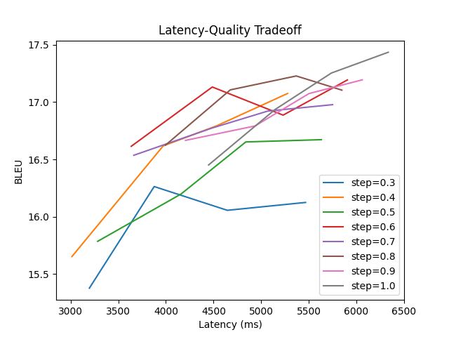

# Cascade with Whisper ASR and M2M100 MT

## Final Results

| ASR Step Length (seconds) | MT LA-2 Step (words) | BLEU  | StreamLAAL | StreamLAAL_CA |
|:-------------------------:|:--------------------:|:-----:|:----------:|:-------------:|
|           0.1             |          1           | 14.43 |    5147    |     14258     |
|           0.1             |          3           | 15.02 |    4628    |     20263     |
|           0.1             |          4           | 15.59 |    5409    |     24851     |
|           0.2             |          1           | 13.82 |   20442    |     47773     |
|           0.2             |          2           | 16.07 |   11520    |     20002     |
|           0.2             |          3           | 15.57 |   13598    |     41024     |
|           0.2             |          4           | 15.43 |    6970    |     28865     |
|           0.3             |          1           | 15.38 |    3197    |      9728     |
|           0.3             |          2           | 16.26 |    3878    |     15189     |
|           0.3             |          3           | 16.06 |    4645    |     13036     |
|           0.3             |          4           | 16.13 |    5466    |     20633     |
|           0.4             |          1           | 15.65 |    3014    |      5924     |
|           0.4             |          2           | 16.62 |    3972    |      7964     |
|           0.4             |          3           | 16.79 |    4535    |      9167     |
|           0.4             |          4           | 17.08 |    5278    |     11265     |
|           0.5             |          1           | 15.79 |    3284    |      6064     |
|           0.5             |          2           | 16.20 |    4159    |      8023     |
|           0.5             |          3           | 16.65 |    4839    |      8668     |
|           0.5             |          4           | 16.67 |    5632    |     10185     |
|           0.6             |          1           | 16.61 |    3637    |      5542     |
|           0.6             |          2           | 17.13 |    4488    |      7032     |
|           0.6             |          3           | 16.89 |    5231    |      9780     |
|           0.6             |          4           | 17.19 |    5905    |     11152     |
|           0.7             |          1           | 16.54 |    3664    |      6250     |
|           0.7             |          2           | 16.77 |    4484    |      7785     |
|           0.7             |          3           | 16.92 |    5068    |      9688     |
|           0.7             |          4           | 16.98 |    5750    |     11317     |
|           0.8             |          1           | 16.63 |    3996    |      6610     |
|           0.8             |          2           | 17.11 |    4676    |      7824     |
|           0.8             |          3           | 17.23 |    5369    |     10743     |
|           0.8             |          4           | 17.10 |    5848    |     11248     |
|           0.9             |          1           | 16.67 |    4206    |      6997     |
|           0.9             |          2           | 16.79 |    4936    |      7355     |
|           0.9             |          3           | 17.07 |    5502    |      8438     |
|           0.9             |          4           | 17.19 |    6061    |      9265     |
|           1.0             |          1           | 16.45 |    4448    |      6153     |
|           1.0             |          2           | 16.94 |    5145    |      7500     |
|           1.0             |          3           | 17.25 |    5737    |      8681     |
|           1.0             |          4           | 17.44 |    6334    |      9581     |